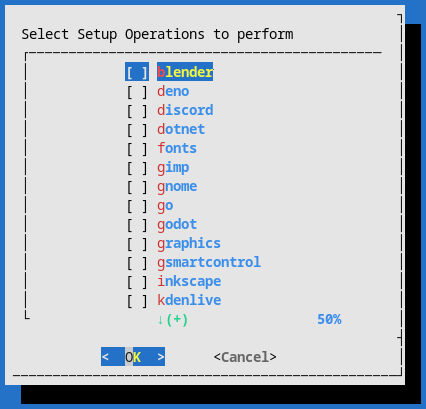

<h1 align="center">
  My <a href="https://archlinux.org">Arch Linux</a> desktop setup
</h1>

[](./LICENSE)

## Purpose

This repo is here to provide myself materials (script, guide, config files, and other files) for cases when I need to transfer to other machine or reinstall the OS.

## Images


<details>
<summary>Click here to see more images</summary>

### Some windows


### Minimalism at its finest


### Script Execution


### Selection Menu



</details>

## Instructions

> **WARNING:**
>
> - This script is written for my laptop ONLY.
> - The script assumes a clean installation (no unnecessary packages installed already).

1. Install arch linux via [archfi](https://github.com/MatMoul/archfi).

   - latest arch linux version as of writing: `2021.10.01`

2. Create user `pomp`

   ```bash
   useradd -m pomp # create user and home directory
   EDITOR=vim visudo # edit sudoers file with vim
   # enable wheel group
   usermod -aG wheel pomp # give pomp sudo access
   ```

3. Execute the [`setup.sh`](./setup.sh) script.
4. Profit.

Full setup could easily take more than a hour depending on the internet speed.

## Hardware

| name    | model                                  |
| ------- | -------------------------------------- |
| Machine | LG 15U480-KP50ML Laptop (15U480-KA5MK) |
| CPU     | intel i5-8250U                         |
| GPU     | Nvidia MX 150                          |

### RAM

| model                             | size |
| --------------------------------- | ---- |
| SK Hynix HMA81GS6AFR8N-UH (stock) | 8GB  |
| Samsung M471A1K43CB1-CRC (added)  | 8GB  |

### Storage

| ID\* | model                                  | Size  |
| ---- | -------------------------------------- | ----- |
| 1    | SK Hynix HFS128G39TND-N210A (30002P10) | 128GB |
| 2    | Samsung SSD 860 PRO 512GB (RVM02B6Q)   | 512GB |

\*arbitrary index I gave. Has no meaning.

### Partitioning

- unallocated space at the end are for overprovisioning
- no swap partition

more information about efi partition can be found in [this](https://wiki.archlinux.org/title/GRUB) arch wiki page.

partitioning done with fdisk ([source](https://git.kernel.org/pub/scm/utils/util-linux/util-linux.git/tree/disk-utils/fdisk.c), [man](https://man7.org/linux/man-pages/man8/fdisk.8.html)).

| drive id\* | format | size                           | mount location   | purpose                           |
| ---------- | ------ | ------------------------------ | ---------------- | --------------------------------- |
| 1          | FAT32  | +300M                          | /boot/efi        | EFI partition                     |
| 1          | ext4   | -15G                           | /                | root                              |
| 2          | ext4   | default (all available sector) | /media/pomp/data | data storage (D drive equivalent) |

\*index from [storage](#Storage)

### Peripherals

|    peripheral | model                                                                                                                                                                                                        |
| ------------: | :----------------------------------------------------------------------------------------------------------------------------------------------------------------------------------------------------------- |
|         mouse | [Logitech G402 Hyperion fury](https://www.logitechg.com/en-eu/products/gaming-mice/g402-hyperion-fury-fps-gaming-mouse.html) I got from a [giveaway event](https://blog.naver.com/yjcomicsblog/221432692995) |
|     headphone | [NOX NX-2](https://www.e-nox.co.kr/theme/s007/index/product_view01.php?wr_id=16)                                                                                                                             |
| laptop cooler | [ABKO NCORE NC500](http://ncore.co.kr/shop/product_item.php?ItId=2586312930)                                                                                                                                 |

## Sources

I randomly change between these wallpapers depending on my mood.

### 3rd Wallpaper


- made by [u/nullcriminal](https://www.reddit.com/r/unixporn/comments/b4dt3y) on reddit

### 2nd Wallpaper


- image from [wallpaperaccess](https://wallpaperaccess.com/full/2752569.png)
- the [image list](https://wallpaperaccess.com/simple-earth) I found it from

### 1st Wallpaper


- [a video](https://www.youtube.com/watch?v=QEWV6fiYaDU) from [Chillhop Music](https://www.youtube.com/channel/UCOxqgCwgOqC2lMqC5PYz_Dg)
- Artwork by [Jeff Östberg](https://jeffostberg.se)
- Animation by [Geneviève Delacroix](http://www.genevievelacroix.com)

### System monitor

https://github.com/developomp/pomky

this [file](./home/pomp/.local/bin/pomky) right here

commit: aecec82

## Future

- 1TB HDD for long-term backup
- [Framework laptop](https://frame.work)
  - AMD eGPU
  - Waiting for: 120+Hz display
  - Waiting for: Korean keyboard
