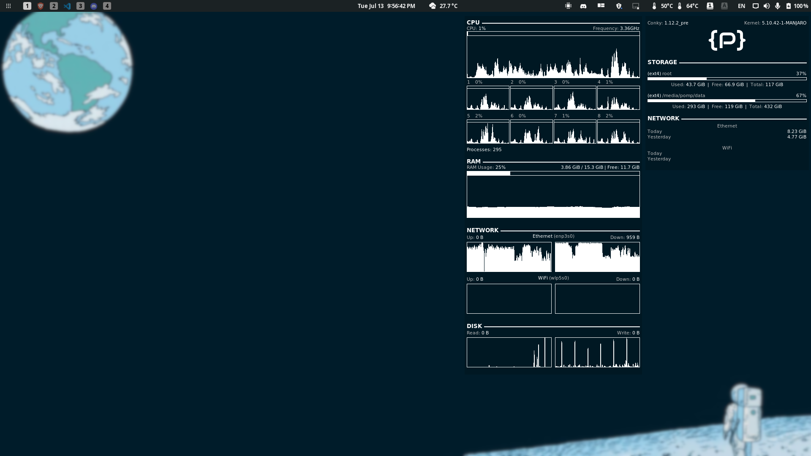
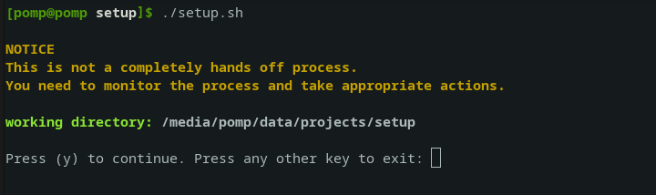

  

  

  

  My <a href="https://manjaro.org">Manjaro</a> desktop setup

---

## Purpose

To provide myself materials (script, guide, and other files) for cases when I need to transfer to other machine or reinstall the OS.

Result: 

## Instructions

1. Execute the [`setup.sh`](./setup.sh) script.
2. Profit.

Full setup could easily take more than a hour depending on the internet speed.

Execution: 

Selection Menu: 

## OS

Manjaro gnome minimal, non-LTS version. Download link can be found in the [official manjaro website](https://manjaro.org/downloads/official/gnome).

Latest version as of writing: `manjaro-gnome-21.0.7-minimal-210614-linux510.iso`

- boot with open source driver

installer config:

- Location
  - region: Asia, Seoul
  - language & locale: en_US.UTF-8 (American English)
- Keyboard
  - Korean, default
- Partitions
  - Erase disk, no swap, no encryption

## Hardware

| name    | model                                  |
| ------- | -------------------------------------- |
| Machine | LG 15U480-KP50ML Laptop (15U480-KA5MK) |
| CPU     | intel i5-8250U                         |
| GPU     | Nvidia MX 150                          |

### RAM

| model                             | size |
| --------------------------------- | ---- |
| SK Hynix HMA81GS6AFR8N-UH (stock) | 8GB  |
| Samsung M471A1K43CB1-CRC (added)  | 8GB  |

### Storage

| ID\* | model                                  | Size  |
| ---- | -------------------------------------- | ----- |
| 1    | SK Hynix HFS128G39TND-N210A (30002P10) | 128GB |
| 2    | Samsung SSD 860 PRO 512GB (RVM02B6Q)   | 512GB |

\*arbitrary index I gave. Has no meaning.

### Partitioning

- unallocated space at the end are for overprovisioning
- no swap partition

more information about efi partition can be found in [this](https://wiki.archlinux.org/title/GRUB) arch wiki.

| drive id\* | format | size (2048 byte sectors) | mount location   | purpose       |
| ---------- | ------ | ------------------------ | ---------------- | ------------- |
| 1          | FAT32  | 614400                   | /boot/efi        | EFI partition |
| 1          | ext4   | 249449294                | /                | root          |
| 2          | ext4   | 921600000                | /media/pomp/data | data storage  |

\*index from [storage](#Storage)

### Peripherals

|    peripheral | model                                                                                                                                                                                                        |
| ------------: | :----------------------------------------------------------------------------------------------------------------------------------------------------------------------------------------------------------- |
|         mouse | [Logitech G402 Hyperion fury](https://www.logitechg.com/en-eu/products/gaming-mice/g402-hyperion-fury-fps-gaming-mouse.html) I got from a [giveaway event](https://blog.naver.com/yjcomicsblog/221432692995) |
|     headphone | [NOX-2](https://www.e-nox.co.kr/theme/s007/index/product_view01.php?wr_id=16)                                                                                                                                |
| laptop cooler | [ABKO NCORE NC500](http://ncore.co.kr/shop/product_item.php?ItId=2586312930)                                                                                                                                 |

## Sources

### Wallpaper 1

- [a video](https://www.youtube.com/watch?v=QEWV6fiYaDU) from [Chillhop Music](https://www.youtube.com/channel/UCOxqgCwgOqC2lMqC5PYz_Dg)
- Artwork by [Jeff Östberg](https://jeffostberg.se​)
- Animation by [Geneviève Delacroix](http://www.genevievelacroix.com)

### Wallpaper 2

- image from [wallpaperaccess](https://wallpaperaccess.com/full/2752569.png)
- the [image list](https://wallpaperaccess.com/simple-earth) I found it from

## Future

1TB hard drive for backup + redundancy
