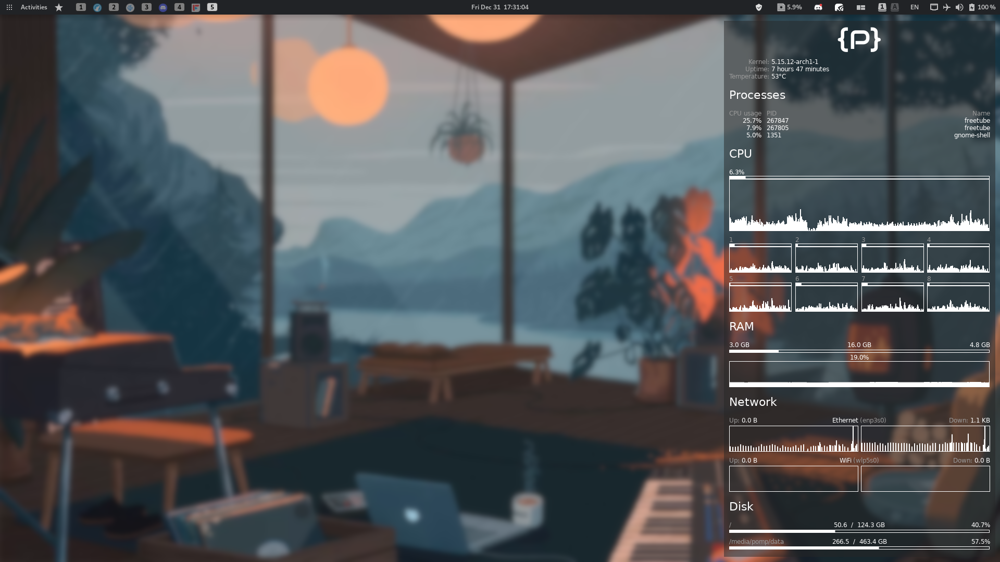
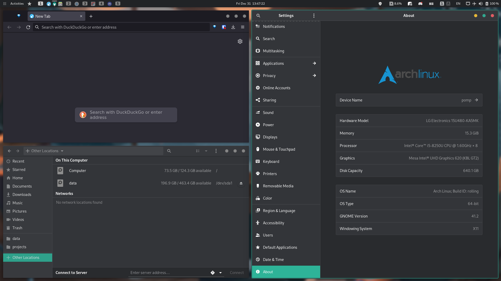
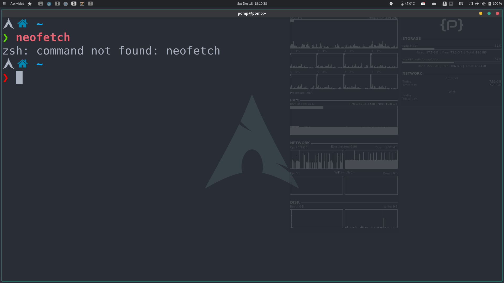
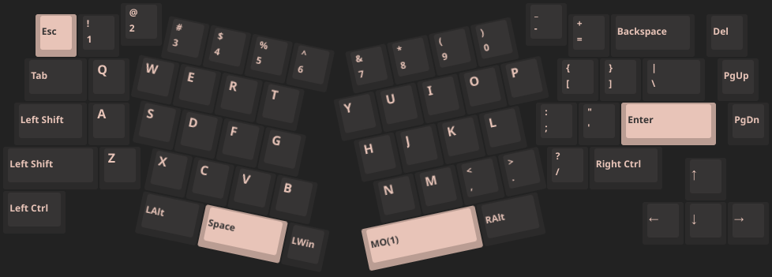
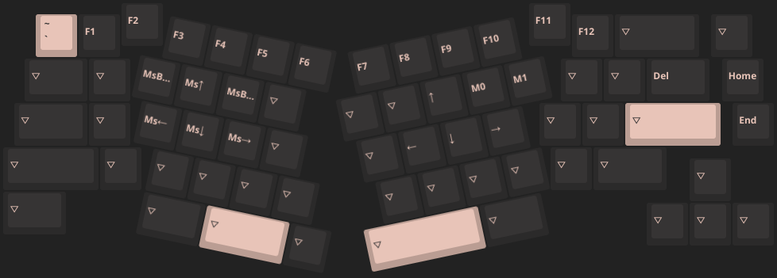

<h1 align="center">
  My <a href="https://archlinux.org">Arch Linux</a> desktop setup
</h1>

[](https://developomp.com/portfolio/linux-setup-script)

<p align="center">
  <b>
    This project is undergoing a <a href="https://github.com/developomp/setup/issues/46">rewrite</a>. Use the <a href="https://github.com/developomp/setup/tree/old">old branch</a> for now.
  </b>
</p>

## Table of contents

<details>
<summary>Click to show table of contents</summary>

- [Table of contents](#table-of-contents)
- [Images](#images)
  - [Some windows](#some-windows)
  - [Minimalism at its finest](#minimalism-at-its-finest)
  - [Script Execution](#script-execution)
- [How does it work?](#how-does-it-work)
- [Usage](#usage)
- [Hardware](#hardware)
  - [Laptop](#laptop)
  - [RAM](#ram)
  - [Storage](#storage)
  - [Partitioning](#partitioning)
  - [Peripherals](#peripherals)
- [Sources](#sources)
  - [3rd Wallpaper](#3rd-wallpaper)
  - [2nd Wallpaper](#2nd-wallpaper)
  - [1st Wallpaper](#1st-wallpaper)
  - [System monitor](#system-monitor)
- [Future plans](#future-plans)
  - [Laptop](#laptop-1)
  - [Storage](#storage-1)
  - [Mouse](#mouse)
  - [Monitor](#monitor)

</details>

## Images



<details>
<summary>Click here to see more images</summary>

### Some windows



### Minimalism at its finest



### Script Execution

Main menu:


Choosing Action:


</details>

## Overview

### Software

|                 Software | Choice                                                                                     |
| -----------------------: | :----------------------------------------------------------------------------------------- |
| Desktop Environment - 🚀 | [GNOME](https://www.gnome.org)                                                             |
|           GTK theme - 🎨 | [vimix-dark-compact-beryl](https://github.com/vinceliuice/vimix-gtk-themes)                |
|               Shell - 🐚 | [zsh](https://github.com/zsh-users/zsh) with [ohmyzsh](https://github.com/ohmyzsh/ohmyzsh) |
|            Terminal - 🖥️ | [alacritty](https://github.com/alacritty/alacritty)                                        |
|        File manager - 📂 | [Nautilus](https://gitlab.gnome.org/GNOME/nautilus)                                        |
|             Browser - 🌐 | [Brave](https://github.com/brave/brave-browser)                                            |
|   Text Editor & IDE - 📝 | [VSCodium](https://github.com/VSCodium/vscodium)                                           |

### Project structure

- `.github/workflows/deploy.yml` - A [github action](https://github.com/features/actions) that makes `setup.py` available at https://setup.developomp.com/
- `.repo` - Extraneous files that does not serve any functional purpose
- `etc` - Files that are copied over to the `/etc` directory
- `home` - Files that are copied over to the `/home/pomp` directory
- `files` - Files that are used but does not get copied
  - `dconf` - [dconf](https://wiki.gnome.org/Projects/dconf) files
- `src` - Python scripts. Check code comments (especially `__init__.py`) for more info

## Usage

1. Install Arch linux.

   A built-in installer (using [archinstall](https://github.com/archlinux/archinstall)) will be added in the future.
   In the meantime, use [archfi](https://github.com/MatMoul/archfi) instead.
   [`sudo`](https://archlinux.org/packages/core/x86_64/sudo/) and [`wget`](https://archlinux.org/packages/extra/x86_64/wget/), and [`paru-bin`](https://aur.archlinux.org/packages/paru-bin/) must be installed.

2. Create a user.

   Create a user in wheel group and create a home directory:

   ```bash
   useradd -G wheel -m pomp
   ```

   Allow user to use sudo:

   ```bash
   EDITOR=vim visudo
   ```

   Now, log in to the user account.

3. Download the setup script.

   ```bash
   wget setup.developomp.com -O setup.py
   ```

4. Execute it.

   ```bash
   python ./setup.py
   ```

Full setup could easily take more than a hour depending on the internet speed.

## Hardware

<details>
  <summary>Click to see hardware information</summary>

### Desktop

No desktop

### Laptop

| name    | model                                                                                                          |
| ------- | -------------------------------------------------------------------------------------------------------------- |
| Machine | [LG 15U480-KP50ML](https://www.lge.co.kr/kr/business/product/common/redirectProductDetail.do?prdId=MD00040678) |
| CPU     | intel i5-8250U                                                                                                 |
| GPU     | Nvidia MX 150                                                                                                  |

### RAM

| model                             | size |
| --------------------------------- | ---- |
| SK Hynix HMA81GS6AFR8N-UH (stock) | 8GB  |
| Samsung M471A1K43CB1-CRC (added)  | 8GB  |

### Storage

- Model: [Samsung 860 PRO SSD 512GB](https://www.samsung.com/sec/support/model/MZ-76P512BW/)
- total size: 512,110,190,592 bytes (476.9 GiB, 512.1 GB)

Partitions sorted by order:

| format | size (parenthesis = rounded values)         | mount location   | purpose           |
| ------ | ------------------------------------------- | ---------------- | ----------------- |
| ext4   | 432,109,780,992 bytes (402.4 GiB, 432.1 GB) | /media/pomp/data | data storage      |
| FAT32  | 524,288,000 bytes (500.0 MiB, 524.3 MB)     | /boot            | EFI partition     |
| ext4   | 64,424,509,440 bytes (60.0 GiB, 64.4 GB)    | /                | system root       |
| N/A    | 15,050,546,688 bytes (14.0 GiB, 15.0 GB)    | N/A              | over-provisioning |

### Peripherals

|     peripheral | model                                                                                                                                                                                                        |
| -------------: | :----------------------------------------------------------------------------------------------------------------------------------------------------------------------------------------------------------- |
|          mouse | [Logitech G402 Hyperion fury](https://www.logitechg.com/en-eu/products/gaming-mice/g402-hyperion-fury-fps-gaming-mouse.html) I got from a [giveaway event](https://blog.naver.com/yjcomicsblog/221432692995) |
|      headphone | [NOX NX-2](https://www.e-nox.co.kr/theme/s007/index/product_view01.php?wr_id=16)                                                                                                                             |
|  laptop cooler | [ABKO NCORE NC500](http://ncore.co.kr/shop/product_item.php?ItId=2586312930)                                                                                                                                 |
|       Keyboard | [COX CK01 PBT SL](https://www.abko.co.kr/brand/detail.php?it_id=1630976200)                                                                                                                                  |
| Drawing tablet | secondhand [wacom CTL-472 (one by wacom)](https://www.wacom.com/en-us/products/pen-tablets/one-by-wacom) (using since May 8, 2022)                                                                           |
|        Monitor | secondhand [HP X24ih](https://www.hp.com/us-en/shop/pdp/hp-x24ih-gaming-monitor) ([review](https://www.rtings.com/monitor/reviews/hp/x24ih)) (using since May 21, 2022)                                      |

#### Keyboard

- Lubed with Krytox 103
- With a towel underneath
- With [COX COS1 walnut wrist rest](https://www.abko.co.kr/brand/detail.php?it_id=1609120628)
- With [matcha keycap w/ Korean letters](https://www.aliexpress.com/item/1005001500813840.html)

<p align="center">
  <b>Video</b>
  <a href="https://youtu.be/8vBm4MfOPME"></a>
</p>

</details>

## Sources

<details>
  <summary>Click to show asset source</summary>

### Wallpaper


- [a video](https://www.youtube.com/watch?v=QEWV6fiYaDU) from [Chillhop Music](https://www.youtube.com/channel/UCOxqgCwgOqC2lMqC5PYz_Dg)
- Artwork by [Jeff Östberg](https://jeffostberg.se)
- Animation by [Geneviève Delacroix](http://www.genevievelacroix.com)
- Effects (in order)
  - [nordified](https://github.com/Schrodinger-Hat/ImageGoNord) (filtering option toggled)
  - GIMP gaussian blur 3.5
  - level 1 compression (GIMP)

</details>

## Future plans

<details>
  <summary>Click to show future plans</summary>

### Laptop

- Features:
  - less than 1 million KRW
  - Korean keyboard with number pad
  - 1920x1080 144Hz IPS display
  - x86_64 architecture
  - GPU with at least 2GB of GDDR5 VRAM
  - DDR5 RAM support
- Candidates:
  - None

### Storage

- 1TB HDD for long-term backup

### Mouse

- Features:
  - go forward / backward button
  - wireless
  - click latency: faster than Logitech G402 without wires
  - weight: lighter than Logitech G402
  - size: similar to Logitech G402
  - max polling rate: no lower, and no higher than 1000Hz
- Candidates:
  - [Logitech G Pro X Superlight](https://www.rtings.com/mouse/reviews/logitech/g-pro-x-superlight)
  - [Razer Viper Ultimate](https://www.rtings.com/mouse/reviews/razer/viper-ultimate)
  - [Razer Viper V2 Pro](https://www.rtings.com/mouse/reviews/razer/viper-v2-pro)

### Keyboard

- Features:
  - Layout: Arisu (Ergonomic 65% ANSI)
  - Case: E-white aluminum
  - PCB: hot-swap sockets
  - Stabilizers: screw-in
  - Keycaps: ZDA profile, matcha theme, with Korean letters, die-subbed
  - Switches: silent linear
  - Spring: Bottom force 35g
  - Switch Lube: undecided
  - Stabilizer Lube: undecided
  - mods:
    - stabilizer rattle
      - [holee mod](https://www.youtube.com/watch?v=-vhpHjlkRgQ)
      - band-aided stabilizer bottom
- Parts & Accessories:
  - [Case + PCB + Stabilizers + Cable](https://ymdkey.com/products/icymdk-wings-aluminum-cnc-top-bottom-qmk-rgb-hotswap-v1-pcb-diy-kit-customied-color?variant=39455544901693) ([aliexpress](https://ko.aliexpress.com/item/1005003330613995.html))
  - [walnut wrist rest](https://ymdkey.com/products/wooden-wrist-rest-solid-wood-walnut-for-wings-split-keyboard) ([aliexpress](https://ko.aliexpress.com/item/1005003629440348.html))
  - [foam](https://ymdkey.com/products/ymdk-wings-foam-mute-cotton) ([aliexpress](https://ko.aliexpress.com/item/1005004451001013.html))
  - Keycaps: existing matcha keycap
  - Switches (outemu silent white)
  - [Switch Opener](https://www.coupang.com/vp/products/6335396443?itemId=13266069688&vendorItemId=80553465572)
  - [Switch Spring](https://www.coupang.com/vp/products/6477237456?itemId=14162877194&vendorItemId=81576424454)
  - [Switch Film](https://ymdkey.com/products/clear-white-mx-switch-film-htv-pc-for-cherry-gateron-jwk-mechanical-keyboard-shaft?_pos=1&_sid=04ac7b5a9&_ss=r&variant=39363145400381) ([alternative](https://www.coupang.com/vp/products/6419579272?itemId=13804146985&vendorItemId=81054458804))
  - Switch Lube (undecided)
  - Stabilizer Lube (undecided)
  - [Switch Opener](https://ymdkey.com/products/2-in-1-cnc-aluminum-anodized-cherry-kailh-gateron-ttc-zealios-switch-opener-for-lube-switches-replacing-spring?_pos=2&_sid=4ea0be237&_ss=r&variant=32944329916477)
- QMK config:
  - [json file](./files/pomp.json) / [hex file](./files/ymdk_wingshs_pomp.hex)
  - Layer 0
    
  - Layer 1
    

### Monitor

- Features:
  - panel: not decided / does not exist
    - no burn-in
    - fast response time (at least faster than my [current monitor](#peripherals))
    - individual pixel lighting (for true black)
    - color accurate
  - normal RGB stripe subpixel layout
  - refresh rate: 144+ Hz
  - size: at most 24in
  - resolution: FHD (1920x1080)
  - flicker-free
- Candidates:
  - None

</details>
