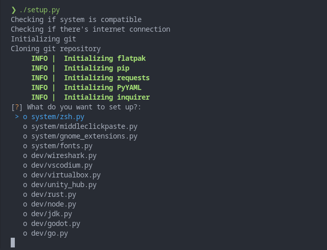

<h1 align="center">
  My <a href="https://archlinux.org">Arch Linux</a> desktop setup
</h1>

[](https://developomp.com/portfolio/linux-setup-script)

<p align="center">
  <b>
    This project is undergoing a rewrite. Use the <a href="https://github.com/developomp/setup/tree/old">old branch</a> for now.
  </b>
</p>

## Table of contents

<details>
<summary>Click to expand</summary>

- [Table of contents](#table-of-contents)
- [Images](#images)
  - [Some windows](#some-windows)
  - [Minimalism at its finest](#minimalism-at-its-finest)
  - [Script Execution](#script-execution)
- [How does it work?](#how-does-it-work)
- [Usage](#usage)
- [Hardware](#hardware)
  - [Laptop](#laptop)
  - [RAM](#ram)
  - [Storage](#storage)
  - [Partitioning](#partitioning)
  - [Peripherals](#peripherals)
- [Sources](#sources)
  - [3rd Wallpaper](#3rd-wallpaper)
  - [2nd Wallpaper](#2nd-wallpaper)
  - [1st Wallpaper](#1st-wallpaper)
  - [System monitor](#system-monitor)
- [Future plans](#future-plans)
  - [Laptop](#laptop-1)
  - [Storage](#storage-1)
  - [Mouse](#mouse)
  - [Monitor](#monitor)

</details>

## Images


<details>
<summary>Click here to see more images</summary>

### Some windows


### Minimalism at its finest


### Script Execution



</details>

## How does it work?

[Github pages](https://pages.github.com) allows the developers to deploy a static website directly from their repositories. I set up github action so that the [`setup.py`](./setup.py) script gets copied to the [`index.html`](https://github.com/developomp/setup/blob/gh-pages/index.html) file in the [`gh-pages`](https://github.com/developomp/setup/tree/gh-pages) branch where it can be accessed from https://setup.developomp.com. The script then downloads necessary files and packages so it can start doing its thing.

## Usage

1. Install Arch linux.

   A built-in installer (using [archinstall](https://github.com/archlinux/archinstall)) will be added in the future.
   In the meantime, use [archfi](https://github.com/MatMoul/archfi) instead.
   `sudo` and `wget` must be installed.

2. Create a user.

   Create a user in wheel group and create a home directory:

   ```bash
   useradd -G wheel -m pomp
   ```

   Allow user to use sudo:

   ```bash
   EDITOR=vim visudo
   ```

   Now, log in to the user account.

3. Download the setup script.

   ```bash
   wget setup.developomp.com -O setup.py
   ```

4. Execute it.

   ```bash
   python ./setup.py
   ```

Full setup could easily take more than a hour depending on the internet speed.

## Hardware

<details>
  <summary>Click to see hardware information</summary>

### Laptop

| name    | model                                                                                                          |
| ------- | -------------------------------------------------------------------------------------------------------------- |
| Machine | [LG 15U480-KP50ML](https://www.lge.co.kr/kr/business/product/common/redirectProductDetail.do?prdId=MD00040678) |
| CPU     | intel i5-8250U                                                                                                 |
| GPU     | Nvidia MX 150                                                                                                  |

### RAM

| model                             | size |
| --------------------------------- | ---- |
| SK Hynix HMA81GS6AFR8N-UH (stock) | 8GB  |
| Samsung M471A1K43CB1-CRC (added)  | 8GB  |

### Storage

| ID\* | model                                  | Size  |
| ---- | -------------------------------------- | ----- |
| 1    | SK Hynix HFS128G39TND-N210A (30002P10) | 128GB |
| 2    | Samsung SSD 860 PRO 512GB (RVM02B6Q)   | 512GB |

\*arbitrary index I gave. Has no meaning.

### Partitioning

- unallocated space at the end are for overprovisioning
- no swap partition

more information about efi partition can be found in [this](https://wiki.archlinux.org/title/GRUB) arch wiki page.

partitioning done with fdisk ([source](https://git.kernel.org/pub/scm/utils/util-linux/util-linux.git/tree/disk-utils/fdisk.c), [man](https://man7.org/linux/man-pages/man8/fdisk.8.html)).

| drive id\* | format | size                           | mount location   | purpose                           |
| ---------- | ------ | ------------------------------ | ---------------- | --------------------------------- |
| 1          | FAT32  | +300M                          | /boot/efi        | EFI partition                     |
| 1          | ext4   | -15G                           | /                | root                              |
| 2          | ext4   | default (all available sector) | /media/pomp/data | data storage (D drive equivalent) |

\*index from [storage](#Storage)

### Peripherals

|    peripheral | model                                                                                                                                                                                                        |
| ------------: | :----------------------------------------------------------------------------------------------------------------------------------------------------------------------------------------------------------- |
|         mouse | [Logitech G402 Hyperion fury](https://www.logitechg.com/en-eu/products/gaming-mice/g402-hyperion-fury-fps-gaming-mouse.html) I got from a [giveaway event](https://blog.naver.com/yjcomicsblog/221432692995) |
|     headphone | [NOX NX-2](https://www.e-nox.co.kr/theme/s007/index/product_view01.php?wr_id=16)                                                                                                                             |
| laptop cooler | [ABKO NCORE NC500](http://ncore.co.kr/shop/product_item.php?ItId=2586312930)                                                                                                                                 |
|      Keyboard | [COX CK01 PBT SL](https://www.abko.co.kr/brand/detail.php?it_id=1630976200)                                                                                                                                  |

</details>

## Sources

<details>
  <summary>Click to show asset source</summary>

- I randomly change between these wallpapers depending on my mood.
- Some wallpaper images are intentionally blurred to improve transparent overlay readability.

### 3rd Wallpaper


- made by [u/nullcriminal](https://www.reddit.com/r/unixporn/comments/b4dt3y)

### 2nd Wallpaper


- image from [wallpaperaccess](https://wallpaperaccess.com/full/2752569.png)
- the [image list](https://wallpaperaccess.com/simple-earth) I found it from
- Effects
  - lv1 compression (GIMP)
  - blur (GIMP gaussian blur 3.0)
  - [nordified](https://github.com/Schrodinger-Hat/ImageGoNord) (filtering option toggled)

### 1st Wallpaper


- [a video](https://www.youtube.com/watch?v=QEWV6fiYaDU) from [Chillhop Music](https://www.youtube.com/channel/UCOxqgCwgOqC2lMqC5PYz_Dg)
- Artwork by [Jeff Östberg](https://jeffostberg.se)
- Animation by [Geneviève Delacroix](http://www.genevievelacroix.com)
- Effects
  - lv1 compression (GIMP)
  - blur (GIMP gaussian blur 3.5)
  - [nordified](https://github.com/Schrodinger-Hat/ImageGoNord) (filtering option toggled)

### System monitor

- [pomky](https://github.com/developomp/pomky) (commit: 8fce169)

[this file](./home/pomp/.local/bin/pomky) right here

</details>

## Future plans

<details>
  <summary>Click to show future plans</summary>

### Laptop

- Features:
  - Korean keyboard
  - Full size arrow keys and number pad
  - DP port
  - x86_64 architecture
  - NO NVIDIA

### Storage

- 1TB HDD for long-term backup

### Mouse

- Features:
  - 1000Hz+ polling rate
  - <=100g weight w/o cable
- Candidates:
  - [Logitech G pro wireless](https://www.logitechg.com/en-us/products/gaming-mice/pro-wireless-mouse)
  - [logitech G pro X](https://www.logitechg.com/en-us/products/gaming-mice/pro-x-superlight-wireless-mouse)
  - With:
    - [Logitech powerplay](https://www.logitechg.com/en-us/products/gaming-mouse-pads/powerplay-wireless-charging)

### Monitor

- Features:
  - HDMI v1.4 compatible
  - Refresh rate: 144Hz
  - resolution: 1920x1080 (FHD)
  - Panel (priority sorted): IPS
- Candidates:
  - [HP X24ih](http://prod.danawa.com/info/?pcode=12600965) ([review](https://www.rtings.com/monitor/reviews/hp/x24ih))
  - [AOC 24G2](http://prod.danawa.com/info/?pcode=10286187) ([review](https://www.rtings.com/monitor/reviews/aoc/24g2))

</details>
