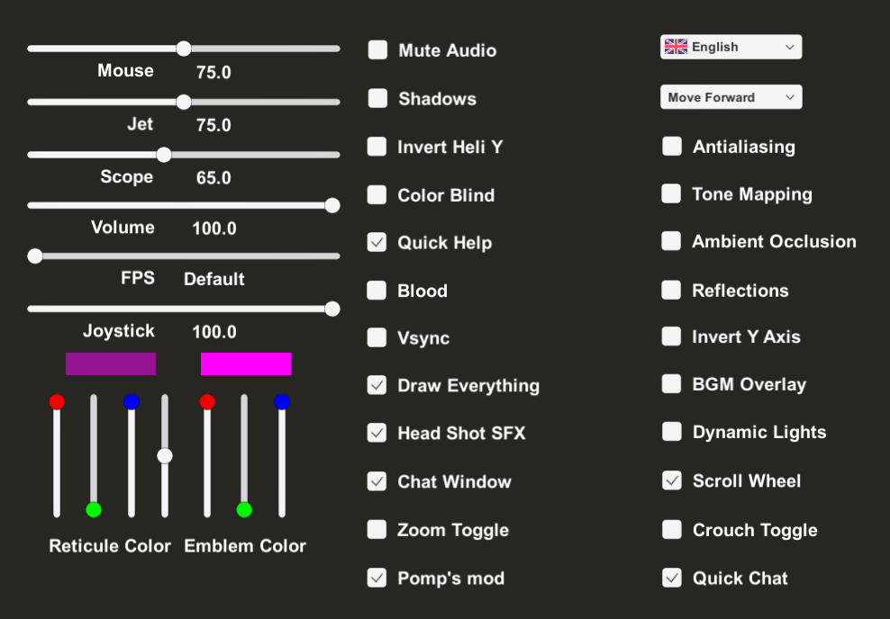
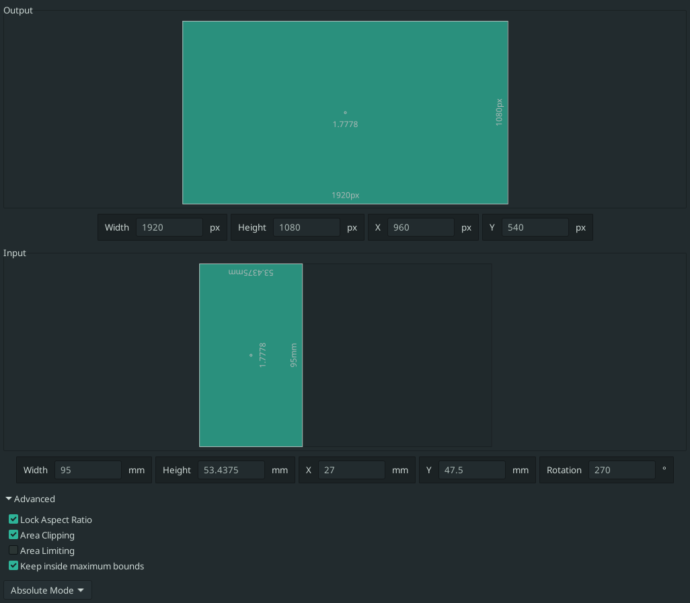

# Game settings

## Mouse

- mouse DPI: 1600
- GNOME mouse speed settings: `org.gnome.desktop.peripherals.mouse.speed=0` (default)

## War Brokers

## Drawing tablet

- [config file](../home/.config/OpenTabletDriver/settings.json)

  
  <b>Video of my grip</b>

