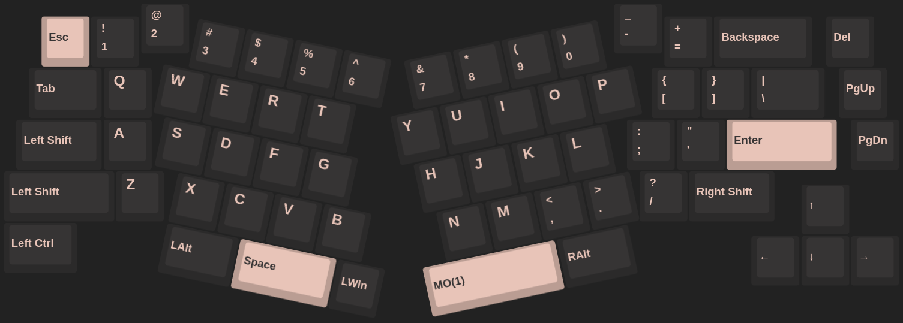

# hardware

## Desktop

No desktop

## Laptop

|    name | model                                                                                           |
| ------: | :---------------------------------------------------------------------------------------------- |
| Machine | secondhand [Lenovo Gaming 3i 15IMH I5 LEGEND PRO](https://prod.danawa.com/info/?pcode=12532946) |
|     CPU | intel i5-10300H                                                                                 |
|     GPU | Nvidia GTX1650 Ti                                                                               |

## Storage

### [Samsung 860 PRO SSD 512GB](https://www.samsung.com/sec/support/model/MZ-76P512BW/)

- total size: 512,110,190,592 bytes (476.9 GiB, 512.1 GB)

| format | size (parenthesis = rounded values)         | mount location    | purpose           |
| ------ | ------------------------------------------- | ----------------- | ----------------- |
| ext4   | 432,109,780,992 bytes (402.4 GiB, 432.1 GB) | /media/pomp/hopme | home directory    |
| N/A    | 15,050,546,688 bytes (14.0 GiB, 15.0 GB)    | N/A               | over-provisioning |

### UMIS RPJTJ256MEE1OWX

- total size: 256,060,514,304 bytes (238.5 GiB, 256.1 GB)

| format | size (parenthesis = rounded values)         | mount location | purpose        |
| ------ | ------------------------------------------- | -------------- | -------------- |
| FAT32  | 535,822,336 bytes (511 MiB, 535.8 MB)       | /boot          | boot partition |
| ext4   | 255,522,242,560 bytes (238.0 GiB, 255.5 GB) | /              | system root    |

## Peripherals

|     peripheral | model                                                                                                                                                                                                        | using since  |
| -------------: | :----------------------------------------------------------------------------------------------------------------------------------------------------------------------------------------------------------- | :----------: |
|      old mouse | [Logitech G402 Hyperion fury](https://www.logitechg.com/en-eu/products/gaming-mice/g402-hyperion-fury-fps-gaming-mouse.html) I got from a [giveaway event](https://blog.naver.com/yjcomicsblog/221432692995) |      -       |
|      new mouse | secondhand [Razer Viper Ultimate](https://www.razer.com/gaming-mice/razer-viper-ultimate)                                                                                                                    | Aug 23, 2022 |
|      headphone | [NOX NX-2](https://www.e-nox.co.kr/theme/s007/index/product_view01.php?wr_id=16)                                                                                                                             |      -       |
|  laptop cooler | [ABKO NCORE NC500](http://ncore.co.kr/shop/product_item.php?ItId=2586312930)                                                                                                                                 |      -       |
|       Keyboard | custom YMDK wings                                                                                                                                                                                            | Aug 13, 2022 |
| Drawing tablet | secondhand [wacom CTL-472 (one by wacom)](https://www.wacom.com/en-us/products/pen-tablets/one-by-wacom)                                                                                                     | May 8, 2022  |
|        Monitor | secondhand [HP X24ih](https://www.hp.com/us-en/shop/pdp/hp-x24ih-gaming-monitor) ([review](https://www.rtings.com/monitor/reviews/hp/x24ih))                                                                 | May 21, 2022 |
|     Microphone | secondhand [Razer Seiren Mini](https://www.razer.com/streaming-microphones/razer-seiren-mini)                                                                                                                | Aug 25, 2022 |

### Keyboard

- Parts & Accessories:
  - [Case + PCB + Stabilizers + Cable](https://ko.aliexpress.com/item/1005003330613995.html) (white)
  - [walnut wrist rest](https://ko.aliexpress.com/item/1005003629440348.html)
  - [foam](https://ko.aliexpress.com/item/1005004451001013.html) (PCB & Bottom Foam)
  - [Switches](https://www.aliexpress.com/item/1005003891937604.html) (Outemu silent peach)
  - [Switch Opener](https://smartstore.naver.com/ownkeeb/products/6804912949)
  - [Switch Film](https://www.aliexpress.com/item/1005002885279946.html) (HTV+PC 0.18mm)
  - [Lube](https://www.aliexpress.com/item/1005002297786498.html) (GPL205 G0 7.6g)
  - [Keycaps](https://www.aliexpress.com/item/1005003834670594.html) (GMK Geoma w/ Korean subs)
- Mods:
  - no-stabilizer
- [keymap](files/wings_hotswap.json):
  - Layer 0
    
  - Layer 1
    

<!-- ### Microphone

OBS loopback -->
